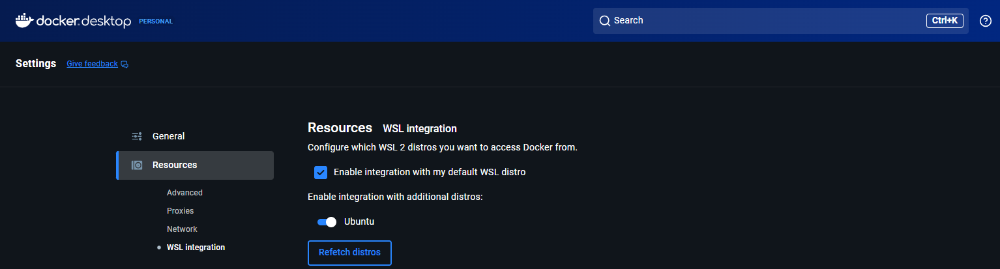
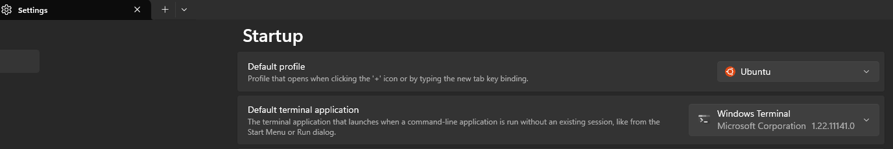

# Understanding the components and setting-up environment

- Docker requires Linux Kernel OS.
- Even if we create containers for windows or mac, a small linux instance will be created on top of which the image will be placed.
- Docker Engine follows OCI standards - Open Container Initiatives
- All tools follow OCI. Images, registry, containers are built following the specifications of OCI.

> Three Ways to run Docker:
>
> - Locally (Docker Desktop)
> - Server (Docker Engine, Kubernetes)
> - Paas (Fargate, Cloud Run by Amazon)

Understanding the components involved here

1. WSL 2:
   * Windows Subsystem for Linux 2
   * It provides the Linux kernel to run on Windows without the need for Virtual Machines like VMWare, etc.
   * It is not a Linux Distribution (distro)
   * A kernel is like the engine of a car. Kernel is responsible for providing memory management, processors, networking of Linux OS.
   * WSL on its own, is not functional.

2. Ubuntu:
   * Ubuntu is a Linux distribution (distro)
   * It provides lots of tools like package management, networks, file systems, user permissions, etc.
   * Ubuntu runs on top of WSL 2.
   * It is like the driver seat of a car that enables a user to make use of above functionalities to interact with the kernel present in WSL 2
   * Ubuntu has its own kernel. But it is used when Ubuntu is installed on its own computer. Since, in this case, windows is the primary OS, Ubuntu make use of the kernel provided by windows (Microsoft) - WSL 2.

3. Docker:
   * Docker is a platform for containerizing an application with the aim to make it run in any environment.
   * Its main concepts:  <u> Build, Ship, Run </u>
      * Build a Docker Image
      * Log it in the Docker Registry
      * Run the application anywhere using Docker Containers
   * Docker commands are run on Ubuntu

> ## How are these three interconnected?
>
> An application is built and ready for deployment.  
> DNS - GoDaddy.com  
> Host - free VPS from Fly.io, Railway, Render, Heroku
>
> Docker is used to containerize and run different servers on each. For example, npm on frontend and postgreSQL for database.
>
> Docker, on top of Ubuntu, makes use of it's CLI and other tools to create and run containers on the kernel (present in WSL 2)
--------------------

## Setting Up

1. Docker Desktop

Download and install from:
https://docs.docker.com/desktop/setup/install/windows-install/

1. It will install with WSL 2: It is Windows Subsystem for Linux 2 that enable windows to run Linux OS without a virtual box.
2. Sign in to Docker
3. The system might need to reboot a couple of times.
4. After installing Ubuntu, open Docker setting. Navigate to `Resources > WSL Integration` and enable Ubuntu integration.
   

2. Download Ubuntu from Microsoft Store

1. Docker by default comes with git, vim, and much more.
2. Once installed, make Ubuntu a default terminal and integrate it with Docker Desktop.

3. Microsoft Terminal

   1. Download from Microsoft store if not present already.
   2. Change its setting to open Ubuntu shell by default.
      

> ## Roadblocks
>
> ### 1. Ubuntu DNS issues
>
> After downloading Ubuntu, I ran into issues with reaching the DNS.
>
> Try `ping www.google.com`. If it throws `fatal: unable to access google.com. Could not resolve host: google.com`, the issue is with resolv.config
>
> Follow the steps below to remove and create a new etc/resolv.config file with correct namespaces
>
> Step 1: Remove the file
>
> `sudo rm -f /etc/resolv.conf`
>
> Step 2: Create new file
>
> `sudo nano /etc/resolv.conf`
>
> Step 3: Add Google's DNS servers
>
> `nameserver 8.8.8.8`
>
> `nameserver 8.8.4.4`
>
> Save and exit (Ctrl+O, Enter, Ctrl+X).
>
> Step 4: Restart network manager
>
> `sudo systemctl restart systemd-networkd`
>
> To check the name of network manager, use this command: `sudo systemctl list-unit-files | grep -i network`. Find the name from the list.
>
> It could be: `networking`, `NetworkManager`, etc.
>
> Step 5: Test DNS
>
> `ping google.com`
>
> Reference:   
> [1]: [Resolving Sudden DNS Issues on Ubuntu: A Step-by-Step Guide](https://medium.com/@ajonesb/resolving-sudden-dns-issues-on-ubuntu-a-step-by-step-guide-1f9ab1c27a32)  
> [2]: [StackExchange](https://superuser.com/questions/1423959/ubuntu-server-fail-to-restart-networking-service-unit-network-service-not-foun)